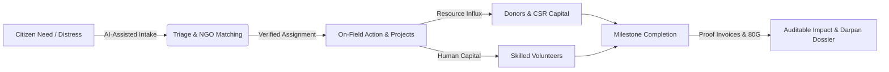
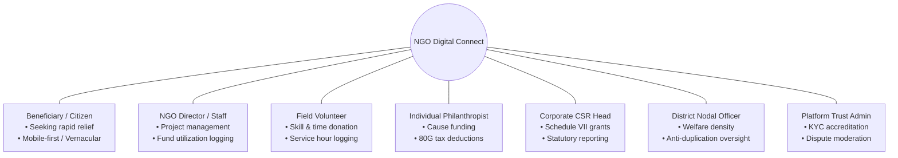
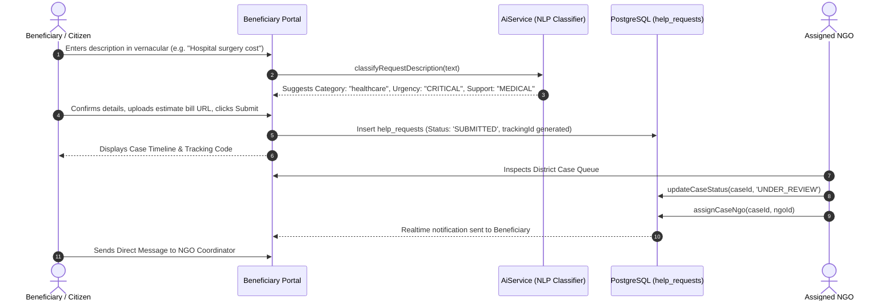
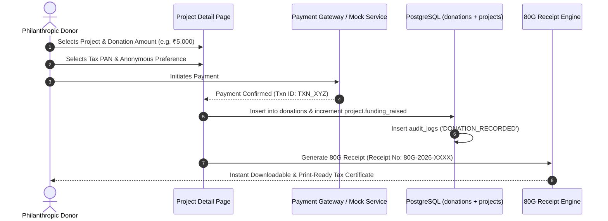
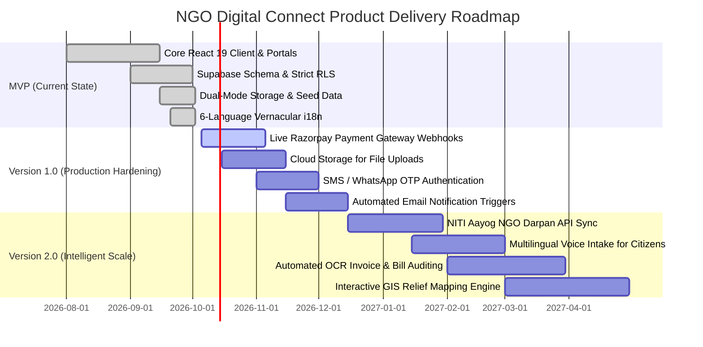

# Product Requirements Document (PRD)

## Project: NGO Digital Connect
**Platform Tagline:** *"Connecting People. Empowering Communities. Creating Measurable Impact."*  
**Document Version:** 1.0.0  
**Status:** Authoritative Product Specification  
**Classification:** Product Definition & Baseline Roadmap  
**Target Environment:** Web (Mobile-Responsive, Low-Bandwidth Optimized)

---

## 1. Executive Summary & Vision

### 1.1 Product Vision
**NGO Digital Connect** is a unified digital ecosystem designed to bridge the structural divide across the social impact landscape in India. The platform centralizes and connects seven distinct stakeholder groups: **Citizens in Need (Beneficiaries)**, **Non-Governmental Organizations (NGOs)**, **Passionate Volunteers**, **Philanthropic Donors**, **Corporate Social Responsibility (CSR) Grantors**, **Government Social Welfare Regulators**, and **Platform Administrators**.

By replacing fragmented spreadsheets, informal messaging channels, and opaque donation pipelines with a transparent, verified, and real-time collaborative system, NGO Digital Connect establishes verifiable trust, eliminates duplicate relief distribution, and accelerates emergency social assistance.

### 1.2 Core Operational Flywheel


### 1.3 Key Problem Statements
1. **Beneficiary Exclusion & Information Asymmetry:** Individuals facing medical crises, educational dropouts, malnutrition, or natural disasters have no centralized, dignified way to discover verified local NGOs or track relief progress.
2. **NGO Operational Overload & Fragmentation:** Grassroots non-profits spend excessive administrative hours managing volunteer rosters, tracking disjointed donations, and writing manual compliance reports instead of executing fieldwork.
3. **Donor Skepticism & Lack of Visibility:** Donors and corporate CSR entities hesitate to allocate funding without itemized, invoice-backed proof of fund utilization and automated Section 80G tax certificates.
4. **Volunteer Disengagement:** Skilled individuals find it difficult to locate localized, cause-specific opportunities that match their availability.
5. **Government & Regulatory Blindspots:** Welfare departments lack unified visibility into regional NGO density, leading to regional relief clustering and unserved aid deserts.

### 1.4 Goals and Success Metrics (KPIs)

| Objective | Key Performance Indicator (KPI) | Baseline (Current) | Target (v1 Production) | Target (v2 Scale) |
| :--- | :--- | :--- | :--- | :--- |
| **Rapid Relief Delivery** | Mean Time to Case Review (MTCR) | Manual (> 72 hrs) | < 6 hours | < 1 hour |
| **Relief Allocation** | Case Resolution Rate | Fragmented | > 85% verified cases | > 95% |
| **Trust & Verification** | % of Active NGOs with Verified Accreditation | Unregulated | 100% KYC & 80G checked | Automated Darpan API validation |
| **Financial Transparency**| Ratio of Donations backed by Itemized Utilization Proof | 0% | 100% on public projects | 100% on-chain / bank-reconciled |
| **Volunteer Mobilization**| Opportunity Fill Rate (% slots filled) | ~30% | > 75% within 7 days | > 90% |
| **Linguistic Inclusion**  | Non-English Session Adoption | 0% | > 45% (Hindi, Bengali, etc.) | > 65% across 10+ languages |

---

## 2. Target Users & Detailed Personas



### Persona 1: Rajesh Mondal (Beneficiary / Citizen in Need)
* **Demographics:** Age 34, Daily wage worker, Howrah, West Bengal.
* **Tech Literacy:** Low-to-medium; operates a budget Android smartphone on 3G/4G; speaks Bengali and Hindi; struggles with complex English forms.
* **Pain Points:** His daughter requires cardiac surgery; unable to navigate complex bureaucratic paperwork; fears predatory middlemen.
* **Needs:** Simple, multi-lingual intake form, ability to upload hospital estimate bills, real-time case tracking without complex account setup, distress SOS button.

### Persona 2: Dr. Ananya Sen (NGO Operations Director - Prerona Mission)
* **Demographics:** Age 46, Social entrepreneur, Kolkata, West Bengal.
* **Tech Literacy:** High; manages laptops and tablets in field offices.
* **Pain Points:** Drowning in spreadsheet records; coordinating 40+ volunteers via unstructured WhatsApp groups; spending days preparing NITI Aayog Darpan and CSR compliance reports.
* **Needs:** Centralized case inbox, smart AI-assisted triage, project milestone management, volunteer assignment with attendance tracking, automated impact dossier export.

### Persona 3: Arjun Mehta (Skilled Volunteer)
* **Demographics:** Age 23, Final-year B.Tech student & certified first-responder, Pune, Maharashtra.
* **Tech Literacy:** Expert; digital native.
* **Pain Points:** Wants to volunteer on weekends but finds NGO websites outdated or unresponsive; lacks formal proof of volunteer hours for his resume.
* **Needs:** Filter opportunities by cause, location, and schedule (weekends/remote); 1-click application; digital logbook of verified service hours.

### Persona 4: Kavita Deshmukh (Philanthropic Donor)
* **Demographics:** Age 39, Senior Software Architect, Bengaluru, Karnataka.
* **Tech Literacy:** High; regular online investor and donor.
* **Pain Points:** Donated to large charities previously but received zero visibility into how her money was spent; experienced delay in getting 80G tax certificates before tax filing deadlines.
* **Needs:** Transparent, project-specific crowdfunding; invoice-level fund utilization breakdowns; instant downloadable 80G receipts; option for anonymous giving.

### Persona 5: Vikramaditya Oberoi (Corporate CSR Lead - Tech Conglomerate)
* **Demographics:** Age 51, VP of Sustainability & Corporate Affairs, Mumbai, Maharashtra.
* **Tech Literacy:** High; enterprise software user.
* **Pain Points:** Must deploy ₹5 Crores annually in compliance with Section 135 & Schedule VII of the Companies Act; managing hundreds of vendor invoices and risk of NGO non-compliance.
* **Needs:** Institutional dashboard, verified NGO directory with MCA CSR-1 and Darpan registration filters, bulk milestone grants, downloadable statutory compliance audits.

### Persona 6: Debashis Mukherjee, IAS (District Social Welfare Officer)
* **Demographics:** Age 48, District Magistrate / Nodal Officer, Government of West Bengal.
* **Tech Literacy:** Moderate; government portal user.
* **Pain Points:** Unaware which private NGOs are operating in specific panchayats; duplicate food rations distributed to the same slums while other areas starve.
* **Needs:** Jurisdiction-specific heatmaps, registered NGO verification logs, aggregate case resolution metrics, macro-level welfare gap analysis.

### Persona 7: Sunita Rao (Platform Trust Administrator)
* **Demographics:** Age 36, Platform Trust & Safety Lead.
* **Tech Literacy:** Expert.
* **Needs:** Rigorous KYC verification pipeline for NGOs (verifying Trust Deeds, 12A/80G, PAN, CSR-1), grievance redressal system for citizen complaints, immutable system audit logs.

---

## 3. User Stories & Acceptance Criteria

### 3.1 Beneficiary Stories
* **US-BEN-01: Vernacular Help Request Submission**
  * *As a* beneficiary,
  * *I want to* submit a distress help request in my local language with category, urgency, and bill estimates,
  * *So that* relevant NGOs near me can provide immediate assistance.
  * **Acceptance Criteria:**
    * System supports English, Hindi, Bengali, Marathi, Tamil, and Telugu (*Implemented*).
    * AI classifier suggests urgency (`CRITICAL`, `HIGH`, `MEDIUM`, `LOW`) and category automatically based on description text (*Implemented*).
    * Supports optional document attachment URLs/receipts (*Implemented*).
    * Generates a unique tracking case ID upon submission (*Implemented*).

* **US-BEN-02: Transparent Case Tracking & Communication**
  * *As a* beneficiary,
  * *I want to* check my case status and send direct messages to the assigned NGO,
  * *So that* I know when relief will arrive without visiting physical offices.
  * **Acceptance Criteria:**
    * Visual case status timeline shows 11 states from `SUBMITTED` to `RESOLVED` (*Implemented*).
    * Direct message conversation thread linked to case ID (*Implemented*).
    * Publicly accessible views must redact beneficiary phone numbers and street addresses (*Implemented in schema / Proposed for frontend views*).

### 3.2 NGO Stories
* **US-NGO-01: Case Intake, Assignment & Resolution**
  * *As an* NGO staff member,
  * *I want to* view assigned cases in my operational district, update statuses, and log resolution evidence,
  * *So that* cases are closed transparently.
  * **Acceptance Criteria:**
    * Filter cases by urgency, category, and status (*Implemented*).
    * Transition case from `UNDER_REVIEW` to `IN_PROGRESS` and `RESOLVED` (*Implemented*).
    * Upload/enter resolution evidence URL and resolution notes before closure (*Implemented*).

* **US-NGO-02: Project Creation & Fund Utilization Logging**
  * *As an* NGO director,
  * *I want to* launch crowdfunding projects with milestones and log expense receipts against categories,
  * *So that* donors trust my organization with their contributions.
  * **Acceptance Criteria:**
    * Create social projects with funding target, timeline, and cause (*Implemented*).
    * Create and mark milestones complete with date and evidence (*Implemented*).
    * Log fund expenditures under categories (Medical, Food, Logistics, etc.) with vendor name and invoice URL (*Implemented*).

* **US-NGO-03: Operations Intelligence Copilot**
  * *As an* NGO manager,
  * *I want to* query an AI assistant for real-time summaries of unresolved cases, underfunded initiatives, and volunteer needs,
  * *So that* I make rapid operational decisions.
  * **Acceptance Criteria:**
    * Natural language query modal responding with live project and case counts (*Implemented*).
    * Quick suggestion buttons for common queries (*Implemented*).

### 3.3 Volunteer Stories
* **US-VOL-01: Opportunity Discovery & Application**
  * *As a* volunteer,
  * *I want to* browse volunteer openings filtered by cause, location, and mode (On-Field, Remote, Hybrid),
  * *So that* I can apply for opportunities matching my skill set.
  * **Acceptance Criteria:**
    * Filter opportunities by mode, cause, and keyword (*Implemented*).
    * Smart matching score displayed based on profile skills (*Implemented*).
    * 1-click application submission with status tracking (*Implemented*).

* **US-VOL-02: Hours Logging & Service Certificates**
  * *As a* volunteer,
  * *I want to* log verified hours completed for accepted opportunities,
  * *So that* my philanthropic contributions are formally certified.
  * **Acceptance Criteria:**
    * Display total hours logged on volunteer dashboard (*Implemented*).
    * Increment hours upon NGO completion verification (*Implemented*).

### 3.4 Donor & CSR Stories
* **US-DON-01: Transparent Project Funding & Instant 80G Receipt**
  * *As a* donor,
  * *I want to* fund a vetted project and immediately receive an official Section 80G tax receipt,
  * *So that* I can claim statutory income tax deductions.
  * **Acceptance Criteria:**
    * Real-time contribution added to project funding total (*Implemented*).
    * Instant 80G receipt generated with NGO PAN, registration, and donor details (*Implemented*).
    * Option to mark donation as anonymous on public leaderboards (*Implemented*).

* **US-CSR-01: Schedule VII Compliant Institutional Pledging**
  * *As a* corporate CSR lead,
  * *I want to* filter vetted NGOs holding CSR-1 numbers and commit institutional grant tranches,
  * *So that* my company meets statutory MCA obligations with auditable proofs.
  * **Acceptance Criteria:**
    * Filter projects by cause and state alignment (*Implemented*).
    * Log corporate wire/RTGS grants against annual CSR budget (*Implemented*).
    * View project expense receipts before releasing subsequent tranches (*Implemented*).

### 3.5 Government & Admin Stories
* **US-GOV-01: Macro Welfare Monitoring & Density Oversight**
  * *As a* district social welfare officer,
  * *I want to* monitor active NGO projects, distress case volumes, and relief metrics in my jurisdiction,
  * *So that* state welfare schemes are coordinated effectively.
  * **Acceptance Criteria:**
    * Filter platform cases and projects by operational district (*Implemented*).
    * Inspect aggregate relief metrics and active NGO registrations (*Implemented*).

* **US-ADM-01: NGO KYC Accreditation & Platform Moderation**
  * *As a* platform trust administrator,
  * *I want to* review NGO registration documents, verify 80G/CSR-1 validity, and resolve community complaints,
  * *So that* bad actors and fraudulent organizations are banned.
  * **Acceptance Criteria:**
    * Verification queue showing pending NGO applicants (*Implemented*).
    * 1-click status update (`VERIFIED`, `REJECTED`, `SUSPENDED`) (*Implemented*).
    * Complaint moderation queue with investigation notes (*Implemented*).
    * Immutable audit log of all administrative actions (*Implemented*).

---

## 4. Functional Requirements (MoSCoW Matrix)

*Status Legend:*  
- **[Implemented]**: Actively present and working in the current codebase (`e:/new`).  
- **[Proposed]**: Architecture designed; requires production implementation / integration.

| ID | Requirement Description | Category | MoSCoW | Status |
| :--- | :--- | :--- | :--- | :--- |
| **FR-01** | Multi-role user registration across 6 user roles | Auth | **Must Have** | **Implemented** |
| **FR-02** | Supabase GoTrue email/password authentication & session restoration | Auth | **Must Have** | **Implemented** |
| **FR-03** | Dual-mode persistence: live Supabase PostgreSQL + LocalStorage fallback | Data | **Must Have** | **Implemented** |
| **FR-04** | Beneficiary help request submission with AI category/urgency classifier | Intake | **Must Have** | **Implemented** |
| **FR-05** | Case status lifecycle tracking across 11 states with status history log | Cases | **Must Have** | **Implemented** |
| **FR-06** | NGO directory with search, cause filters, and accreditation badges | NGO | **Must Have** | **Implemented** |
| **FR-07** | Social project crowdfunding with milestone tracking and progress bars | Projects | **Must Have** | **Implemented** |
| **FR-08** | Volunteer opportunity creation, application workflow, and hour logging | Volunteer | **Must Have** | **Implemented** |
| **FR-09** | Donor portal with certified Section 80G tax receipt generator | Donations| **Must Have** | **Implemented** |
| **FR-10** | Itemized fund utilization logging with expense categories and invoices | Finance | **Must Have** | **Implemented** |
| **FR-11** | Admin NGO accreditation queue with document inspection | Governance| **Must Have** | **Implemented** |
| **FR-12** | Multi-lingual vernacular support across 6 Indian languages | UX/i18n | **Must Have** | **Implemented** |
| **FR-13** | CSR corporate portal with budget tracking and Schedule VII tagging | CSR | **Should Have** | **Implemented** |
| **FR-14** | Government monitoring portal with district jurisdiction filtering | Gov | **Should Have** | **Implemented** |
| **FR-15** | Direct messaging between beneficiary and assigned NGO | Messaging| **Should Have** | **Implemented** |
| **FR-16** | Live WebSocket data updates via Supabase Realtime channels | Realtime | **Should Have** | **Implemented** |
| **FR-17** | Heuristic NGO Operational Assistant (Copilot) in NGO dashboard | AI | **Should Have** | **Implemented** |
| **FR-18** | Real Razorpay / Cashfree payment gateway webhook integration | Payments | **Should Have** | **Proposed** |
| **FR-19** | Multi-Factor Authentication (TOTP / SMS OTP) for Admin & NGO logins | Security | **Should Have** | **Proposed** |
| **FR-20** | Automated NITI Aayog NGO Darpan API integration for instant validation| Gov | **Could Have** | **Proposed** |
| **FR-21** | Multilingual Voice-to-Text intake for low-literacy citizens | AI/i18n | **Could Have** | **Proposed** |
| **FR-22** | Interactive GIS Mapbox/Google Maps integration with relief pins | Maps | **Could Have** | **Proposed** |
| **FR-23** | Automated OCR verification of hospital bills & NGO 80G certificates | AI | **Could Have** | **Proposed** |
| **FR-24** | Public Ethereum / Polygon Blockchain donation tracking ledger | Web3 | **Won't Have (v1)**| **Out of Scope**|
| **FR-25** | Native iOS and Android mobile app store binaries | Mobile | **Won't Have (v1)**| **Out of Scope**|

---

## 5. Non-Functional Requirements (NFRs)

### 5.1 Performance Targets
* **First Contentful Paint (FCP):** < 1.2 seconds on standard 4G networks.
* **Largest Contentful Paint (LCP):** < 2.0 seconds on mobile viewports.
* **Client-Side Bundle Size:** < 180 KB gzipped (achieved via Vite ES-module treeshaking; React 19 core + vanilla CSS design tokens, zero bulky UI libraries).
* **Database Query Latency:** < 100 ms for indexed queries in PostgreSQL.

### 5.2 Accessibility (a11y)
* **Standard:** Conformance with **WCAG 2.1 Level AA**.
* **Visual Ergonomics:** Minimum color contrast ratio of 4.5:1 for normal text and 3:1 for large headers and badges across both Light and Dark themes.
* **Keyboard Navigation:** Full focus management with visible focus rings (`:focus-visible`), logical tab orders, and screen-reader accessible ARIA labels on all icon buttons (`aria-label` applied on Header, ThemeToggle, LanguageSwitcher, and Modal controls).

### 5.3 Localization & Low-Bandwidth Resilience
* **Supported Languages:** English (`en`), Hindi (`hi`), Bengali (`bn`), Marathi (`mr`), Tamil (`ta`), Telugu (`te`).
* **Instant Switching:** Zero-reload in-memory translation updates via React Context.
* **Low-Bandwidth Mode:**
  * Application shell loads and functions completely even if remote Supabase connection times out or fails, using synchronized `localStorage` caching (`StorageService`).
  * Lightweight SVG icons bundled inline (`Icons.tsx`) avoiding heavy external font/icon CDN downloads.
  * System fonts priority: `-apple-system, BlinkMacSystemFont, "Segoe UI", Roboto, "Noto Sans", sans-serif`.

---

## 6. Key User Flows (Mermaid Diagrams)

### 6.1 NGO Registration, Verification & Accreditation Flow
```mermaid
sequenceDiagram
    autonumber
    actor NGO as NGO Representative
    participant UI as Register Page
    participant Auth as Supabase Auth
    participant DB as PostgreSQL (Profiles + NGO Details)
    actor Admin as Platform Administrator

    NGO->>UI: Fill Organization Name, Reg No, Mission, Causes, City
    NGO->>UI: Submit Registration
    UI->>Auth: supabase.auth.signUp(email, password, metadata)
    Auth->>DB: Trigger handle_new_user() -> Insert profiles & ngo_details (Status: PENDING)
    Auth-->>UI: Return Auth Session
    UI-->>NGO: Show "Pending Accreditation" Badge on Portal
    
    Admin->>UI: Access Admin Portal -> NGO Verification Queue
    UI->>DB: Fetch unverified NGOs & submitted documentation
    Admin->>UI: Click "Verify & Accredit"
    UI->>DB: Update verification_status = 'VERIFIED'
    DB->>DB: Insert into audit_logs ('NGO_VERIFICATION_APPROVED')
    DB-->>UI: Live Realtime broadcast update
    UI-->>NGO: Verified Badge displayed; Projects eligible for public crowdfunding
```

### 6.2 Beneficiary Help Request Intake & AI Triage Flow


### 6.3 Crowdfunding Donation & Section 80G Receipting Flow


### 6.4 Volunteer Discovery & Application Flow
```mermaid
sequenceDiagram
    autonumber
    actor Vol as Volunteer
    participant Opps as Opportunities Feed
    participant AI as AiService (Skill Matcher)
    participant DB as PostgreSQL (applications)
    actor NGO as NGO Coordinator

    Vol->>Opps: Views open volunteer listings
    Opps->>AI: matchOpportunitiesForVolunteer(skills, causes, listings)
    AI-->>Opps: Ranks opportunities by Match Score (e.g. 95% Match)
    Vol->>Opps: Clicks "Apply for Opportunity"
    Opps->>DB: Insert volunteer_applications (Status: 'PENDING')
    DB-->>NGO: Application appears in NGO Volunteer Tab
    NGO->>DB: updateApplicationStatus(appId, 'ACCEPTED')
    Vol->>Opps: Opportunity marked "Accepted"; logs 8 service hours
    NGO->>DB: logVolunteerHours(appId, 8) -> Increments volunteer total
```

---

## 7. Scope Boundaries & Constraints

### 7.1 In-Scope
1. Complete role-specific dashboards for 7 user personas.
2. Full lifecycle management for citizen help requests and NGO social projects.
3. Itemized fund utilization ledger with category tagging and invoice proofs.
4. Instant Section 80G tax receipt generation for financial contributions.
5. Heuristic AI triage engine for emergency request categorization and urgency assignment.
6. Offline-resilient local cache fallback for low-connectivity environments.
7. Six-language Indian vernacular localization.

### 7.2 Out-of-Scope (for Current Release)
1. Processing physical currency or cash-in-hand logistics.
2. Direct integration with physical hospital Electronic Medical Record (EMR) systems.
3. Native mobile device biometric authentication (Fingerprint / FaceID).
4. Direct disbursement of government treasury pensions or direct benefit transfers (DBT).

### 7.3 Constraints & Dependencies
* **Browser Requirements:** Modern evergreen browsers (Chrome 100+, Safari 15+, Firefox 100+, Edge) with ECMAScript 2022 and LocalStorage support.
* **Connectivity:** Capable of operating in low-bandwidth (2G/3G) environments with graceful degradation to local data state.
* **Regulatory Compliance:** Adherence to the **India Digital Personal Data Protection (DPDP) Act 2023**, Section 135 & Schedule VII of the Companies Act 2013, and Income Tax Act Section 80G guidelines.

---

## 8. Release Roadmap



* **Phase 1: MVP (Current Implemented State)**
  * Complete 7-role portal architecture with rich UI workflows.
  * Supabase PostgreSQL database schema with 21 tables and security triggers.
  * Natural language intake classifier and smart matching heuristics.
  * Instant 80G tax receipt generator and fund utilization ledger.
  * English + 5 Indian languages vernacular switcher.
  * Dual-mode local cache fallback.

* **Phase 2: Version 1.0 (Production Hardening)**
  * Replace mock payments with verified live Razorpay / Cashfree webhook integration.
  * Implement Supabase Storage buckets with strict MIME-type and virus scanning for uploaded evidence.
  * Integrate SMS OTP (Fast2SMS / Twilio) for passwordless mobile login for low-literacy beneficiaries.
  * Security hardening: Disable demo 1-click logins on production builds; enforce server-side RBAC validation.

* **Phase 3: Version 2.0 (Intelligent Scale)**
  * Real-time automated verification via NITI Aayog NGO Darpan registry.
  * Vernacular speech-to-text intake using Whisper / Bhashini API.
  * Optical Character Recognition (OCR) for auto-verifying medical hospital bills and purchase invoices.
  * Dynamic geospatial heatmaps highlighting district-level aid distribution and unserved zones.

---

## Open Questions
1. Should unverified beneficiaries be permitted to submit medical requests without uploading a primary government photo ID (Aadhaar / Voter ID), or does this introduce fraudulent claim risks?
2. What is the regulatory consensus on whether platform-generated Section 80G receipts require a digital cryptographic signature (e-Sign) under IT Act Section 5?
3. Should corporate CSR donations incur a nominal platform maintenance fee (e.g., 1.5%), or should the platform remain 100% free for all stakeholders?

## Next Steps
1. Finalize the Technical Requirements Document (`TRD.md`) to define the precise database schemas, RPC functions, and API specifications.
2. Conduct an exhaustive security audit (`SECURITY.md`) to remediate client-side authorization bypasses and implement strict OWASP safeguards.
3. Review and baseline the System Architecture (`SYSTEM_ARCHITECTURE.md`) to guide production CI/CD deployment.
