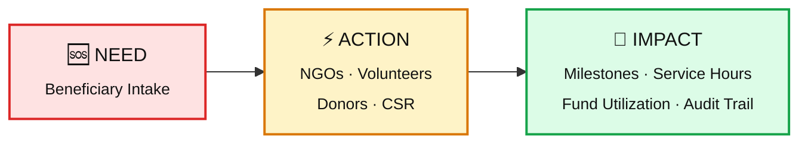
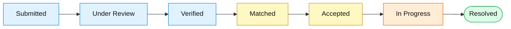
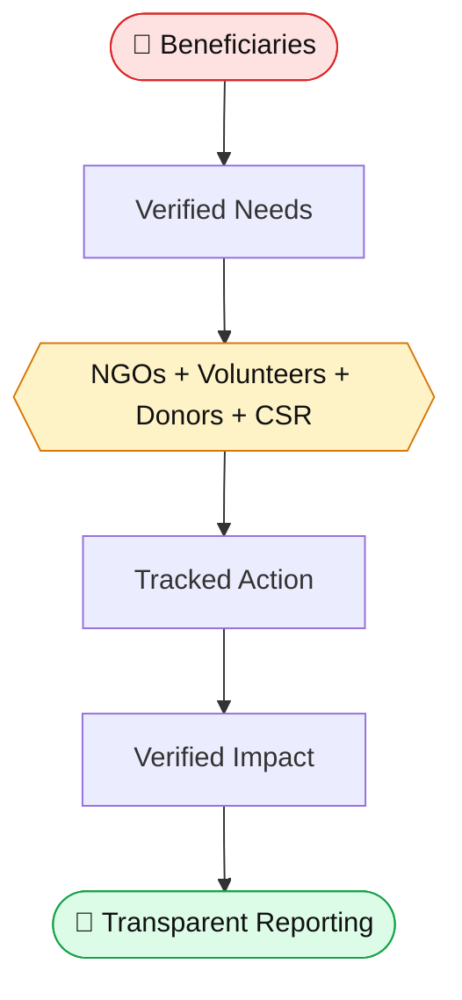

<div align="center">

# 🤝 NGO Digital Connect

### An Integrated, Traceable Platform for the Social Impact Ecosystem

**`NEED`** &nbsp;➜&nbsp; **`ACTION`** &nbsp;➜&nbsp; **`IMPACT`**

<br/>

[](https://ngo-digital-connect.vercel.app)


<br/>

*Beneficiaries in need · Accredited non-profits · Volunteers · Individual donors · CSR institutions · Government monitoring agencies — united in a single, verifiable lifecycle.*

<br/>

[**Overview**](#-overview) •
[**Features**](#-key-product-capabilities) •
[**Quick Start**](#-quick-start) •
[**Demo Personas**](#-demo-personas) •
[**Architecture**](#-architecture--file-structure) •
[**Security**](#-security--privacy-guarantees) •
[**AI**](#-ai-powered-features)

</div>

---

## 🌟 Overview

NGO Digital Connect creates a **transparent digital ecosystem** where every rupee, every volunteer hour, and every case can be traced from the moment a need is raised to the moment impact is verified.



---

## 🚀 Key Product Capabilities

### 🌍 1. Public Discovery Surface

| Feature | Description |
|---|---|
| 🏠 **Ecosystem Home** | Visualizes the Need → Action → Impact journey with live metrics and featured initiatives |
| ✅ **Verified NGO Directory** | Faceted filtering by cause focus, operating state, and 12A / 80G accreditation badges |
| 📂 **Multi-Metric Project Catalog** | Real-time tracking of capital raised, volunteer enrollment, and beneficiaries reached |
| 🙋 **Volunteer Opportunities Hub** | Capacity-capped slot discovery with one-click application |
| 📒 **Global Impact Ledger** | Ecosystem outcomes computed dynamically from live database records |

### 🧑‍🤝‍🧑 2. Beneficiary Intake & Protection

| Feature | Description |
|---|---|
| 🧠 **AI-Assisted Natural Language Intake** | Infers cause category, support type, and urgency from plain-language descriptions |
| 📍 **Status-Driven Tracker** | Transparent step-by-step case progress (see below) |
| 💬 **Caseworker Channel** | Private, scoped communication with assigned NGO caseworkers |
| 🔒 **Zero Public PII** | Phone numbers, street addresses, and medical certificates stay strictly confidential |



### 🏢 3. NGO Operations Hub

| Feature | Description |
|---|---|
| 📥 **Triage Inbox** | Review incoming requests filtered by critical priority and geographic proximity |
| 🏗️ **Project Builder & Milestones** | Launch multi-metric initiatives with verifiable field milestones |
| 🧾 **Audited Expense Ledger** | Itemize spend against remaining project balance, with vendor references |
| 🗂️ **Volunteer Coordination Desk** | Accept or decline applications without over-allocation; log verified service hours |
| 🤖 **AI Operations Copilot** | Natural-language queries for underfunded projects, urgent cases, and volunteer capacity |
| 📄 **Statutory Impact Dossier Generator** | One-click printable executive impact reports for institutional partners |

### 🙌 4. Volunteer Mobilization Engine

- 🎯 Profile indexing for verified skills and availability
- ✨ Smart AI matching that scores opportunities against volunteer competencies
- ⏱️ Tracking of accepted assignments, attendance, and accredited service hours

### 💝 5. Philanthropic Donor Suite

- 🔎 Project discovery by cause and geography
- 💳 Interactive contribution checkout with project-level fund allocation
- 🧾 **80G Tax Receipt Vault** — generate and print tax-deductible certificates
- 📊 Itemized fund utilization visibility
- 🕑 Donation and contribution history

### 🏛️ 6. Institutional CSR Suite

- 📚 Schedule VII statutory cause filters
- 🤝 Grant commitments tied directly to active field projects
- 🧮 Audited expenditure tables for CSR reporting
- 📈 Project-level CSR impact tracking

### 🗺️ 7. Government & Institutional Monitoring Suite

- 📊 Macro-level district social-density analytics across major Indian states
- 🔁 Welfare non-duplication checks to surface overlapping regional needs
- 🏅 Accredited non-profit roster organized by regional jurisdiction
- 📍 District-level project and beneficiary visibility

### 🛡️ 8. Platform Trust & Administration Suite

- 🪪 **NGO KYC Accreditation Desk** — review pending registrations, inspect 12A / 80G / CSR-1 details, grant the Verified Trust Badge
- ⚖️ **Content Moderation & Dispute Desk** — investigate community complaints and enforce standards
- 🔗 **Immutable Audit Trail Explorer** — searchable, chronological log of platform operations

---

## ⚡ Quick Start

### Prerequisites

| Requirement | Version |
|---|---|
| Node.js | `v18+` or `v20+` |
| Package manager | `npm` or `pnpm` |

### Run the development server

```bash
# Clone the repository and move into the project directory
npm install
npm run dev
```

Then open **<http://localhost:5173>** in your browser.

### Build for production

Verifies TypeScript compilation and generates optimized bundles:

```bash
npm run build
```

---

## 🎭 Demo Personas

Pre-configured demo accounts cover every major stakeholder role. Switch instantly using the **top-bar demo switcher**, or sign in with a registered email.

| Role | Persona | Email | Context |
|---|---|---|---|
| 🧑 **Beneficiary** | Rajesh Mondal | `rajesh.mondal@example.com` | Daily wage artisan seeking urgent pediatric heart surgery support |
| 🏢 **NGO Director** | Dr. Ananya Sen | `contact@preronamission.org` | *Prerona Relief Mission* — Sundarbans healthcare & disaster relief |
| 🏢 **NGO Director** | Priya Sharma | `director@vidyajyoti.org` | *Vidya Jyoti Foundation* — solar smart classrooms |
| 🙋 **Volunteer** | Arjun Mehta | `arjun.mehta@example.com` | Weekend STEM educator & field triage volunteer |
| 💝 **Donor** | Kavita Deshmukh | `kavita.deshmukh@example.com` | Tech entrepreneur supporting child healthcare & digital literacy |
| 🏛️ **CSR Lead** | Vikramaditya Oberoi | `csr@tatanetworks.com` | *Tata Networks CSR Foundation* — Schedule VII grant allocations |
| 🗺️ **Government Nodal** | Debashis Mukherjee, IAS | `dm.kolkata@wb.gov.in` | Dept. of Social Welfare & Disaster Management |
| 🛡️ **Platform Admin** | Platform Oversight | `admin@ngodigitalconnect.org` | Compliance, KYC accreditation & moderation |

> 🔗 **Try it live:** [ngo-digital-connect.vercel.app](https://ngo-digital-connect.vercel.app)

---

## 🛡️ Role-Based Access

| Role | Primary Capabilities |
|---|---|
| 🧑 **Beneficiary** | Submit cases, track requests, communicate with assigned caseworkers |
| 🏢 **NGO** | Manage cases, projects, volunteers, expenses, and impact |
| 🙋 **Volunteer** | Discover opportunities, apply, track assignments and service hours |
| 💝 **Donor** | Discover projects, contribute, track impact and receipts |
| 🏛️ **CSR** | Review projects, manage grants, monitor CSR impact |
| 🗺️ **Government** | Monitor regional needs, projects, and institutional coverage |
| 🛡️ **Admin** | Manage accreditation, moderation, compliance, and audit records |

---

## 📁 Architecture & File Structure

<details>
<summary><b>Click to expand the full project tree</b></summary>

<br/>

```text
src/
├── types/
│   └── models.ts            # TypeScript domain schemas, lifecycles & DTOs
│
├── data/
│   ├── seedData.ts          # Multi-tenant demonstration records
│   └── causes.ts            # Cause taxonomy, Indian states/cities, skill tags
│
├── store/
│   ├── AuthContext.tsx      # Auth session, role switching & RBAC
│   └── DataContext.tsx      # Central state, relational persistence & audit logging
│
├── services/
│   ├── aiService.ts         # NLP intake classification, smart matching & NGO copilot
│   └── storageService.ts    # Application persistence layer
│
├── components/
│   ├── common/
│   │   ├── Icons.tsx        # Comprehensive SVG icon set
│   │   ├── Header.tsx       # Navigation, persona switcher & notification drawer
│   │   ├── Footer.tsx       # Transparency footer & privacy information
│   │   ├── Badge.tsx        # Universal status & urgency badge
│   │   └── ProgressBar.tsx  # Multi-metric visualizer
│   └── ai/
│       └── NgoAssistantModal.tsx   # Interactive AI Copilot
│
├── pages/
│   ├── public/
│   │   ├── HomePage.tsx             # Landing page & dynamic statistics
│   │   ├── NgoDirectoryPage.tsx     # Verified NGO directory
│   │   ├── NgoDetailPage.tsx        # Public NGO profile & initiatives
│   │   ├── ProjectDirectoryPage.tsx # Project catalog
│   │   ├── ProjectDetailPage.tsx    # Project details & contribution interface
│   │   ├── OpportunitiesPage.tsx    # Volunteer opportunities
│   │   ├── ImpactPage.tsx           # Ecosystem metrics & public audit ledger
│   │   ├── LoginPage.tsx            # Unified login & persona launcher
│   │   └── RegisterPage.tsx         # Multi-role onboarding
│   │
│   └── portals/
│       ├── BeneficiaryPortal.tsx    # Case intake, tracking & caseworker channel
│       ├── NgoPortal.tsx            # Triage, projects, expenses & volunteers
│       ├── VolunteerPortal.tsx      # Assignments & recommended opportunities
│       ├── DonorPortal.tsx          # Contribution history, receipts & milestones
│       ├── CsrPortal.tsx            # CSR grant management & reporting
│       ├── GovernmentPortal.tsx     # Regional analytics & welfare monitoring
│       └── AdminPortal.tsx          # KYC, moderation & audit management
│
├── App.tsx                  # Master router: public pages + portals
└── index.css                # Responsive CSS design system
```

</details>

---

## 🔒 Security & Privacy Guarantees

| Rule | Principle | What it means |
|:---:|---|---|
| **101** | 🔐 **Beneficiary Seclusion** | Private addresses, contact numbers, and medical documents are hidden from public visitors, donors, volunteers, and institutional users. Access follows role-based controls. |
| **102** | 🎟️ **Deterministic Volunteer Capacity** | No opportunity can accept more volunteers than its capacity. The UI locks applications once slots are filled. |
| **103** | 🎯 **Project-Linked Contributions** | Contributions are tied to active projects with defined funding goals, never to unassigned platform funds. |
| **104** | 🧾 **Itemized Fund Utilization** | NGOs record spend by category, vendor name, amount, and invoice reference. |
| **105** | 🔗 **Audit Trajectory** | Case transitions, contribution records, and accreditation changes are written to the audit trail. |

---

## 💳 Contribution & Payment Interface

Donors can:

- ✅ Browse active social-impact projects
- ✅ Review project funding progress
- ✅ Select a contribution amount and review it before submission
- ✅ Associate contributions with specific projects
- ✅ View contribution history and receipt information

> [!NOTE]
> The current application ships the **payment and contribution user interface** as part of the donor experience. Payment-provider backend integrations, recurring subscription infrastructure, payment webhooks, and external payment dashboards are **not** part of the current architecture.

---

## 🧠 AI-Powered Features

| Feature | What it does |
|---|---|
| 🩺 **Beneficiary Intake Classification** | Identifies likely cause category and support type; estimates urgency from submitted descriptions |
| 🧩 **Volunteer Matching** | Compares skills and availability with opportunity requirements and recommends the best fits |
| 🤖 **NGO Operations Copilot** | Surfaces underfunded projects, unresolved urgent cases, and volunteer-capacity insights through natural-language queries |

> AI features are designed to **assist** users while keeping core decisions and actions inside the application's role-based workflows.

---

## 🗃️ Data & Application State

Structured domain models and centralized state manage:

| | | |
|---|---|---|
| 👤 User profiles | 🏢 NGO information | 🆘 Beneficiary cases |
| 📂 Projects | 🏁 Project milestones | 💰 Contributions |
| 🙋 Volunteer opportunities | 📝 Volunteer applications | ⏱️ Service hours |
| 🏛️ CSR initiatives | 🗺️ Government monitoring data | 🪪 Accreditation records |
| 🔗 Audit records | 🔔 Notifications | |

---

## 📊 Impact Tracking

Metrics are derived directly from the application's underlying records and surfaced on public and institutional dashboards.

| 👥 Beneficiaries reached | 📂 Active projects | 💰 Funds raised | 🧾 Funds utilized |
|:---:|:---:|:---:|:---:|
| **🙋 Volunteer participation** | **⏱️ Verified service hours** | **✅ Resolved cases** | **🏢 NGO participation** |
| **🏛️ CSR initiatives** | **🗺️ Regional project coverage** | | |

---

## 🎯 Project Vision



The goal is to connect stakeholders, improve visibility into social-impact initiatives, and create a **traceable journey from need to measurable impact**.

---

## 📌 Project Status

NGO Digital Connect is a **demonstration platform** showcasing an integrated digital workflow for beneficiaries, NGOs, volunteers, donors, CSR institutions, government stakeholders, and platform administrators.

**Focus areas:** Social-impact discovery · Beneficiary case management · NGO operations · Volunteer coordination · Donor contributions · CSR project management · Institutional monitoring · AI-assisted workflows · Privacy-aware data handling · Auditability & transparency · Impact measurement

---

<div align="center">

### 🌐 Experience it live

[](https://ngo-digital-connect.vercel.app)

<sub>Built to turn **Need** into **Action** and **Action** into verified **Impact**. 💚</sub>

</div>
