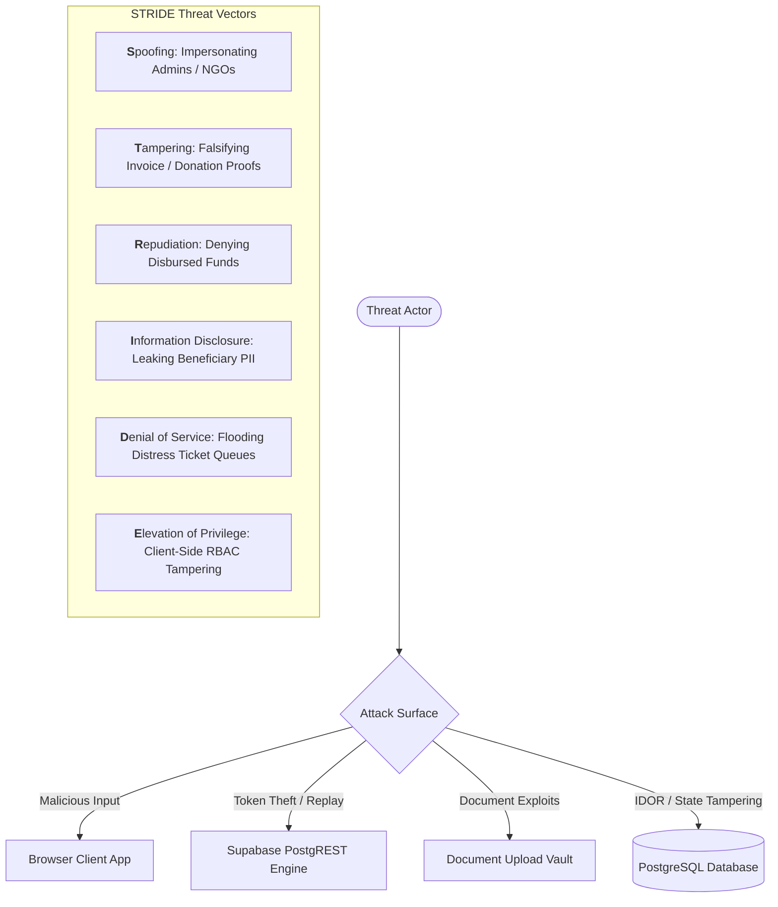
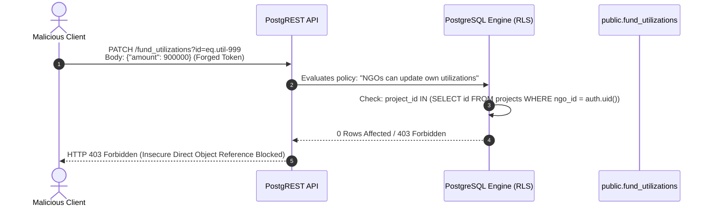
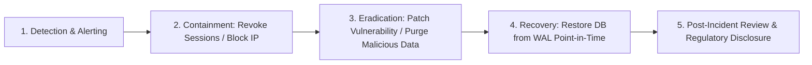

# Security Architecture & Threat Model (SECURITY.md)

## Project: NGO Digital Connect
**Document Version:** 1.0.0  
**Classification:** Defensive Engineering & Threat Mitigation  
**Governing Standards:** OWASP Top 10 (2021/2025), STRIDE Threat Modeling, India DPDP Act 2023, IT Act 2000 Section 43A, PCI-DSS Level 4 Guidance

---

## 1. STRIDE Threat Model

The threat model evaluates the system across six threat categories, mapping system assets against potential adversarial actors and exposure surfaces:



### 1.1 Threat Matrix & Asset Valuation

| STRIDE Category | Target Asset | Threat Scenario | Impact | Built-in / Planned Mitigation |
| :--- | :--- | :--- | :--- | :--- |
| **Spoofing** | User Identity & Roles | Malicious user registers as an accredited NGO or impersonates an IAS Government Nodal Officer. | **Critical** | Mandatory administrative KYC verification queue for NGOs (`ngo_details.verification_status`); Government registration requires official `.gov.in` domain verification. |
| **Tampering** | Fund Utilization & Milestones | Compromised NGO edits invoice URLs or alters project milestone completion records to siphon donations. | **High** | PostgreSQL trigger-backed immutable `audit_logs` table; Row Level Security (RLS) restricting milestone updates exclusively to the verified project owner. |
| **Repudiation** | Donations & Grants | Donor claims they never authorized a ₹5,00,000 CSR wire grant; or NGO claims funds were never received. | **Medium** | Unique cryptographically verifiable Section 80G receipt numbers (`receipt_number: 80G-YYYY-XXXX`); mandatory payment transaction reference recording. |
| **Information Disclosure** | Beneficiary PII | Scrapers or adversaries query public endpoints to harvest phone numbers, home addresses, and acute medical diagnoses of vulnerable citizens. | **Critical** | Database-level column masking and Row Level Security; public API responses redact phone numbers, exact addresses, and full citizen names. |
| **Denial of Service** | Help Request Queue | Bots submit thousands of fraudulent `CRITICAL` urgency requests, burying legitimate emergency distress calls. | **High** | Rate-limiting on ticket submission endpoints (IP-based and account-based); CAPTCHA verification on unauthenticated forms; AI anomaly scoring. |
| **Elevation of Privilege** | Administrative Controls | Regular volunteer or donor manipulates client-side JavaScript state (`can('VERIFY_NGO')`) to accredit fraudulent NGOs. | **Critical** | Complete server-side RBAC enforcement via PostgreSQL Row Level Security; client-side checks treated strictly as cosmetic UI toggles. |

---

## 2. Authentication & Session Management

### 2.1 Identity Architecture
* **Identity Provider:** Supabase GoTrue identity server utilizing RFC 7519 JSON Web Tokens (JWT).
* **Token Lifetime:** Short-lived access tokens (1 hour expiration) paired with cryptographically secure rolling refresh tokens stored in secure client storage.
* **Session Lifecycle:** Managed via `supabase.auth.onAuthStateChange` with automatic token refresh before expiration (`autoRefreshToken: true`).

### 2.2 Password Policy & Hardening Guidelines
* **Current Code State:** `RegisterPage.tsx` enforces `password.length < 6` (Flagged as Vulnerability SEC-FINDING-04).
* **Production Policy Specification:**
  * Minimum length: **12 characters**.
  * Entropy requirement: At least 1 uppercase letter, 1 lowercase letter, 1 number, and 1 special symbol (`[!@#$%^&*]`).
  * Breached Password Check: Integration with HaveIBeenPwned API via Supabase Auth configuration to prevent credential stuffing.
  * Rate-Limiting: Lock account for 15 minutes after 5 consecutive failed login attempts.

### 2.3 Multi-Factor Authentication (MFA / 2FA)
* **High-Privilege Roles:** Mandatory Time-based One-Time Password (TOTP via Google Authenticator / Authy) for all accounts with `ADMIN`, `GOVERNMENT`, or `NGO` roles.
* **Low-Bandwidth Beneficiary Access:** Passwordless SMS OTP (via Fast2SMS / Twilio) providing instant 6-digit verification without password memorization burdens.

---

## 3. Authorization & RBAC Enforcement (IDOR Defense)



### 3.1 Row Level Security (RLS) Policy Architecture
Client-side authorization checks (`can(action)` in `AuthContext.tsx`) are purely cosmetic for user interface rendering. The authoritative defense perimeter resides entirely within PostgreSQL RLS policies in `supabase/migrations/20261001_realtime_auth_rls.sql`:

1. **Beneficiary Data Isolation:**
   ```sql
   CREATE POLICY beneficiary_own_cases ON public.help_requests
   FOR ALL TO authenticated
   USING (beneficiary_id = auth.uid() OR current_user_role() IN ('ADMIN', 'NGO'));
   ```
2. **NGO Project Management Isolation:**
   ```sql
   CREATE POLICY ngo_manage_own_projects ON public.projects
   FOR ALL TO authenticated
   USING (ngo_id = auth.uid() OR current_user_role() = 'ADMIN')
   WITH CHECK (ngo_id = auth.uid() OR current_user_role() = 'ADMIN');
   ```
3. **Financial Utilization Immutability:**
   ```sql
   CREATE POLICY ngo_log_own_utilization ON public.fund_utilizations
   FOR INSERT TO authenticated
   WITH CHECK (
       current_user_role() = 'ADMIN' OR
       EXISTS (
           SELECT 1 FROM public.projects 
           WHERE projects.id = fund_utilizations.project_id 
           AND projects.ngo_id = auth.uid()
       )
   );
   ```

---

## 4. OWASP Top 10 (2021/2025) Vulnerability Mapping

| OWASP Vulnerability | Risk in NGO Digital Connect | Technical Mitigation Implemented / Required |
| :--- | :--- | :--- |
| **A01: Broken Access Control** | Modifying another NGO's project expenses or inspecting private citizen medical requests (IDOR). | Strict PostgreSQL Row Level Security (RLS) policies on all 21 tables; server-side validation of `auth.uid()`. |
| **A02: Cryptographic Failures** | Eavesdropping on donor tax PAN or beneficiary distress records in transit or at rest. | Enforce TLS 1.3 in transit; AES-256 encryption at rest in PostgreSQL; TLS HSTS headers (`max-age=31536000`). |
| **A03: Injection** | SQL injection via help request search or NoSQL injection in JSON data models. | Parameterized prepared statements executed exclusively via PostgREST; zero raw SQL string concatenation in services. |
| **A04: Insecure Design** | Unverified charities collecting public funds without valid 80G / 12A accreditation. | Two-stage accreditation workflow: NGO projects remain unlisted until approved by Platform Administrator in `AdminPortal`. |
| **A05: Security Misconfiguration** | Default CORS headers allowing unauthorized domains to invoke Supabase APIs; exposed `.env` files. | Restricted CORS origin allowlist in Supabase dashboard; `.gitignore` actively blocking `.env` and `.env.local`. |
| **A06: Vulnerable & Outdated Components** | Vulnerabilities in React 19 dependencies or build plugins. | Weekly automated `npm audit` scans; Dependabot alerts enabled; locked dependency tree via `package-lock.json`. |
| **A07: Identification & Auth Failures** | Demo 1-click role switcher allowing unauthenticated admin takeover in production. | **SEC-FINDING-01**: Environment-guarded removal of demo accounts in production builds (`import.meta.env.PROD`). |
| **A08: Software & Data Integrity Failures** | Malicious script or trojan uploaded as a medical invoice PDF. | MIME-type sniffing validation; blocking executable extensions; scanning uploads in Supabase Storage. |
| **A09: Security Logging & Monitoring Failures** | Undetected administrative privilege abuse or unauthorized KYC verifications. | Immutable `audit_logs` table tracking actor UUID, IP address, timestamp, target entity, and prior/new state diff. |
| **A10: Server-Side Request Forgery (SSRF)** | Fetching arbitrary external URLs provided in invoice or image URLs. | Prohibit backend server fetches of user-supplied external URLs; enforce Supabase Storage bucket URLs only. |

---

## 5. Data Protection, Privacy & Statutory Compliance

### 5.1 India Digital Personal Data Protection (DPDP) Act 2023 Alignment
1. **Notice & Consent:** Citizens submitting help requests receive plain-language notices in their chosen vernacular language explaining that their name and medical distress description will be shared with accredited regional NGOs for relief delivery.
2. **Data Minimization:** Financial records and hospital bills are retained only for the statutory audit duration required by the Income Tax Act (7 years), after which medical records are scrubbed.
3. **Right to Erasure:** Beneficiaries can request complete deletion of closed case records, which scrubs names, phone numbers, and address coordinates while retaining anonymized statistical metrics.

### 5.2 Payment Data & PCI-DSS Compliance
* **Zero Cardholder Data Storage:** NGO Digital Connect **never** touches, transmits, or stores credit/debit card primary account numbers (PAN), CVVs, or UPI PINs.
* **Tokenized Gateways:** All financial checkout flows delegate entirely to PCI-DSS Level 1 certified gateways (Razorpay / Cashfree) via secure iframe or redirect modals.
* **Section 80G Compliance:** Donor PAN numbers collected for 80G tax certificates are masked (e.g. `ABCDE****F`) in public views and stored encrypted in the database.

---

## 6. Security Vulnerability Findings & Remediation Table

The following audit findings represent active vulnerabilities identified in the codebase scan:

| ID | Severity | File Location | Vulnerability Description | Remediation / Fix |
| :--- | :---: | :--- | :--- | :--- |
| **SEC-01** | **CRITICAL** | `src/pages/public/LoginPage.tsx`<br/>(Lines 16–24, 80–116) | **Unauthenticated Role Impersonation:** 1-Click demo accounts grid allows anyone to log in as `ADMIN`, `NGO`, or `GOVERNMENT` without a password. | Wrap demo accounts in `if (import.meta.env.DEV)` check; strictly remove demo accounts and `loginAsRole` from production builds. |
| **SEC-02** | **HIGH** | `src/store/AuthContext.tsx`<br/>(Lines 349–373) | **Client-Side Authorization Bypass:** The `can(action)` function evaluates permissions purely in React state. | Enforce all authorization in PostgreSQL Row Level Security (RLS) policies; treat `can()` strictly as an aesthetic UI helper. |
| **SEC-03** | **HIGH** | `src/services/storageService.ts`<br/>(Lines 27–40, 52–58) | **Plaintext PII Storage in LocalStorage:** Citizen distress details, phone numbers, addresses, and donor PAN records are stored unencrypted in `localStorage`. | Eliminate localStorage caching of sensitive personal data; rely exclusively on authenticated Supabase sessions with memory-only state. |
| **SEC-04** | **HIGH** | `src/pages/portals/BeneficiaryPortal.tsx`<br/>`src/pages/portals/NgoPortal.tsx` | **Unvalidated Document URLs:** Invoice proofs and medical evidence accept arbitrary string URLs without validation. | Replace open text inputs with authenticated Supabase Storage uploads with strict MIME-type and extension validation. |
| **SEC-05** | **HIGH** | `src/pages/public/HomePage.tsx`<br/>`src/store/DataContext.tsx` | **Public Exposure of Beneficiary PII:** Public components have access to unredacted phone numbers and street addresses in `HelpRequest`. | Create a database view `public_help_requests` that omits `contactPhone` and `address`, and masks `beneficiaryName`. |
| **SEC-06** | **MEDIUM** | `src/pages/public/RegisterPage.tsx`<br/>(Lines 89–92) | **Weak Password Policy:** Passwords of only 6 characters are accepted without complexity or breach checks. | Enforce minimum 12 characters, require mixed case, numbers, and symbols, and enable Supabase compromised password detection. |
| **SEC-07** | **MEDIUM** | `src/lib/supabase.ts`<br/>(Lines 20–24) | **Silent Dummy Key Fallback:** Missing environment variables fallback to dummy placeholder URLs without halting execution. | Throw a visible initialization error or display a persistent "Demo Offline Mode" header banner when keys are absent. |
| **SEC-08** | **MEDIUM** | `src/store/DataContext.tsx` | **Lack of API Rate Limiting:** No client or server rate limiting on help request submissions or direct messages. | Configure Supabase API rate limiting (e.g. 5 requests/min per IP) and add client-side debounce cooldown timers. |

---

## 7. Incident Response, Backup & Disaster Recovery



### 7.1 Incident Handling Protocols
1. **P1 (Critical Data Breach / Unauthorized Admin Access):**
   * Action: Immediately revoke all active Supabase GoTrue JWT refresh tokens (`auth.admin.signOut()`).
   * Rotate `SUPABASE_SERVICE_ROLE_KEY` and database passwords in the Supabase management console.
   * If citizen PII is compromised, notify the Indian Computer Emergency Response Team (**CERT-In**) within 6 hours as mandated by CERT-In directions.
2. **Automated Point-in-Time Recovery (PITR):**
   * PostgreSQL Write-Ahead Logging (WAL) enabled with 7-day continuous PITR backup.
   * Daily encrypted database dumps pushed to an isolated, multi-region AWS S3 bucket with Object Lock (WORM).

---

## 8. Pre-Launch Security Checklist

- [ ] **Hardcoded Secrets Check:** Verify zero private API keys, service role keys, or database credentials exist in git history.
- [ ] **Production Demo Removal:** Ensure `loginAsRole` and the 1-click demo login buttons are completely stripped from production bundles.
- [ ] **RLS Audit:** Run automated tests confirming that a Beneficiary JWT cannot read another Beneficiary's case documents or an unverified NGO's private drafts.
- [ ] **Security Headers:** Enforce modern HTTP headers via hosting configuration (Vercel / Cloudflare / Netlify):
  * `Content-Security-Policy: default-src 'self'; connect-src 'self' https://*.supabase.co wss://*.supabase.co; img-src 'self' data: https:; script-src 'self'; style-src 'self' 'unsafe-inline';`
  * `Strict-Transport-Security: max-age=31536000; includeSubDomains; preload`
  * `X-Content-Type-Options: nosniff`
  * `X-Frame-Options: DENY`
  * `Referrer-Policy: strict-origin-when-cross-origin`
- [ ] **MIME-Type & Anti-Malware Validation:** Ensure Supabase Storage rejects all non-PDF and non-image file uploads.
- [ ] **Input Sanitization:** Verify all user-generated content rendered into DOM elements is properly escaped to prevent Cross-Site Scripting (XSS).

---

## Open Questions
1. Should emergency distress cases allow anonymous submissions without phone number verification, or does this expose the system to coordinated spam attacks?
2. What cryptographic protocol should be adopted for tamper-proofing digital Section 80G tax receipts (e.g. SHA-256 HMAC digital seal vs. government-approved DSC token)?
3. What is the statutory retention requirement under Indian law for deleted citizen distress requests containing medical records?

## Next Steps
1. Apply code patches to resolve the 8 vulnerabilities documented in Section 6.
2. Review the high-level design and architectural decision records in `SYSTEM_ARCHITECTURE.md`.
3. Configure automated security scans using GitHub CodeQL and Trivy in the CI/CD pipeline.
