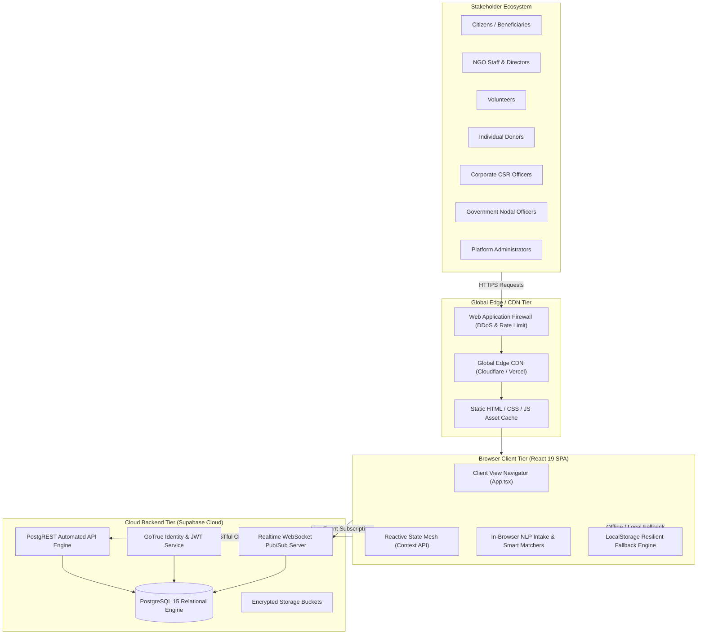
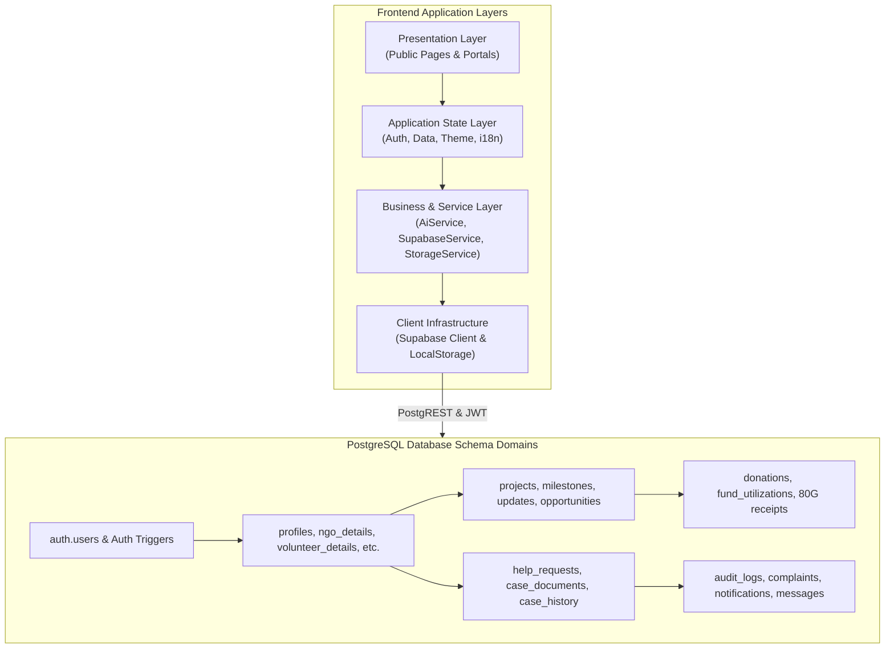
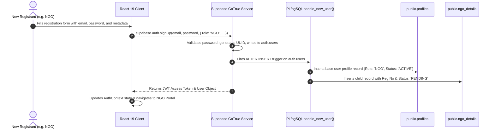
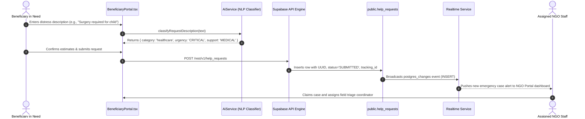
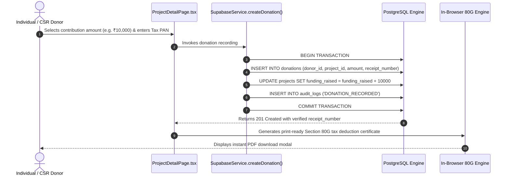

# System Architecture Document (SYSTEM_ARCHITECTURE.md)

## Project: NGO Digital Connect
**Document Version:** 1.0.0  
**Status:** Authoritative Architectural Blueprint  
**Classification:** Core System Architecture & Engineering Blueprint  
**Target Topology:** Single-Page Web Application (SPA) on Global CDN with Managed PostgreSQL / Supabase Backend-as-a-Service (BaaS)

---

## 1. High-Level Architecture Overview & Design Principles

The architecture of **NGO Digital Connect** is designed to achieve maximum accessibility, high data integrity, low-bandwidth resilience, and zero maintenance friction across the complex Indian non-profit landscape:



### 1.1 Core Architectural Principles
1. **Low-Bandwidth & Mobile-First Execution:** Engineered to render smoothly on budget mobile hardware over intermittent 2G/3G rural networks. Built with zero runtime CSS-in-JS overhead, system font stacks, and inline SVG assets producing a gzipped client bundle under 180 KB.
2. **Dual-Engine Persistence:** Operates seamlessly across two distinct operational modes:
   * *Cloud Mode:* Full live persistence with PostgreSQL, PostgREST, and WebSocket push updates via Supabase.
   * *Resilient Offline Fallback:* Automatically falls back to browser `localStorage` and localized seed fixtures when cloud network access is disrupted.
3. **Database-Driven Security Perimeter:** Authorization logic is enforced at the database layer via PostgreSQL **Row Level Security (RLS)**, ensuring that compromised client-side code cannot bypass data isolation boundaries.
4. **Verifiable Auditability:** Financial transactions and non-profit accreditations are backed by immutable relational ledgers (`audit_logs`, `fund_utilizations`), preventing unauthorized repudiation.

---

## 2. System Context & Component Architecture



### 2.1 Layer Responsibilities & Boundaries

| Layer | Primary Technologies | Core Responsibilities & Boundaries |
| :--- | :--- | :--- |
| **Presentation Tier** | React 19, Vanilla CSS Custom Properties | Renders 8 public pages and 7 role-specific portals. Enforces accessibility (WCAG AA), responsive breakpoints, and vernacular text rendering. Contains zero direct SQL or database logic. |
| **Application State Tier** | React Context API (`AuthContext`, `DataContext`, `ThemeContext`, `LanguageContext`) | Maintains global client collections, coordinates user authentication, optimistic UI updates, error toast dispatching, and WebSocket subscription lifecycles. |
| **Business Logic Tier** | `aiService.ts`, `storageService.ts` | Executes in-browser heuristic NLP triage, smart NGO and volunteer matching algorithms, operational copilot synthesis, and local cache serialization. |
| **Data Access Tier** | `supabaseService.ts`, `@supabase/supabase-js` | Formulates structured PostgREST queries, joins role-specific child tables, handles database transaction mappings, and coordinates real-time event subscriptions. |
| **Persistence & Security Tier** | PostgreSQL 15, PostgREST, PL/pgSQL | Enforces foreign key constraints, unique indexes, database triggers (`handle_new_user`), and Row Level Security (RLS) data isolation. |

---

## 3. Data Flow Diagrams (Key System Journeys)

### 3.1 Authentication & Profile Provisioning Data Flow


### 3.2 Citizen Help Request Submission & AI Triage Data Flow


### 3.3 Crowdfunding Donation & Section 80G Receipting Data Flow


---

## 4. Complete Project Directory Structure

```
e:\new\
├── .env.example                        # Template defining required and optional environment variables
├── .gitignore                          # Git configuration excluding node_modules, build output, and local env files
├── eslint.config.js                    # ESLint configuration for React 19 and TypeScript
├── index.html                          # Main HTML entrypoint with viewport, SEO meta tags, and root mounting point
├── LICENSE                             # Open-source licensing agreement (MIT)
├── package.json                        # NPM package metadata, scripts, and runtime/dev dependencies
├── package-lock.json                   # Deterministic dependency lockfile
├── README.md                           # High-level project documentation, feature overview, and quick-start instructions
├── tsconfig.app.json                   # TypeScript compiler options for the React application bundle
├── tsconfig.json                       # Root TypeScript solution reference configuration
├── tsconfig.node.json                  # TypeScript compiler options for Vite configuration scripts
├── vite.config.ts                      # Vite build configuration with React plugin and dev server settings
│
├── public/
│   ├── favicon.svg                     # Vector icon used in browser tabs
│   └── icons.svg                       # SVG icon sprite sheet for public assets
│
├── src/
│   ├── App.css                         # Supplementary application layout and navigation styles
│   ├── App.tsx                         # Root application shell orchestrating routing, top-level layout, and context providers
│   ├── index.css                       # Master design system with CSS custom properties, tokens, and components
│   ├── main.tsx                        # React DOM client entrypoint initializing React 19 root
│   │
│   ├── assets/
│   │   ├── hero.png                    # Primary visual banner used on the homepage hero section
│   │   ├── react.svg                   # React brand logo asset
│   │   └── vite.svg                    # Vite build tool brand asset
│   │
│   ├── components/
│   │   ├── ai/
│   │   │   └── NgoAssistantModal.tsx   # Interactive AI copilot modal for NGO operations intelligence
│   │   └── common/
│   │       ├── Badge.tsx               # Reusable status and category pill badge components
│   │       ├── Footer.tsx              # Global footer with vernacular links, statutory credits, and copyright
│   │       ├── Header.tsx              # Global navigation header with role selector, language switcher, and theme toggle
│   │       ├── Icons.tsx               # Centralized zero-dependency SVG icon component library
│   │       ├── LanguageSwitcher.tsx    # Dropdown component for instant 6-language switching
│   │       ├── ProgressBar.tsx         # Visual progress bar component for crowdfunding and milestones
│   │       └── ThemeToggle.tsx         # Toggle button switching between Light and Dark color themes
│   │
│   ├── data/
│   │   ├── causes.ts                   # Master list of social causes, categories, Indian states, and operational cities
│   │   └── seedData.ts                 # Realistic demonstration datasets for offline testing across all 7 user roles
│   │
│   ├── i18n/
│   │   ├── LanguageContext.tsx         # React context managing current locale, translation strings, and persistence
│   │   ├── types.ts                    # TypeScript interfaces defining nested localization keys and translation dictionaries
│   │   └── translations/
│   │       ├── bn.ts                   # Bengali language dictionary
│   │       ├── en.ts                   # English baseline dictionary
│   │       ├── hi.ts                   # Hindi language dictionary
│   │       ├── index.ts                # Translation dictionary aggregation and export hub
│   │       ├── mr.ts                   # Marathi language dictionary
│   │       ├── ta.ts                   # Tamil language dictionary
│   │       └── te.ts                   # Telugu language dictionary
│   │
│   ├── lib/
│   │   └── supabase.ts                 # Supabase client initialization, configuration checks, and connection fallback
│   │
│   ├── pages/
│   │   ├── portals/
│   │   │   ├── AdminPortal.tsx         # Platform governance portal for NGO accreditation, complaints, and audits
│   │   │   ├── BeneficiaryPortal.tsx   # Citizen portal for distress help request submission, AI intake, and tracking
│   │   │   ├── CsrPortal.tsx           # Corporate portal for Schedule VII grants, CIN tracking, and budget allocation
│   │   │   ├── DonorPortal.tsx         # Individual donor portal for project contributions and certified 80G tax receipts
│   │   │   ├── GovernmentPortal.tsx    # Regulatory portal for district jurisdiction monitoring and welfare density
│   │   │   ├── NgoPortal.tsx           # Comprehensive NGO operations hub for cases, projects, volunteers, and utilization
│   │   │   └── VolunteerPortal.tsx     # Volunteer hub for opportunity discovery, skill matching, and hour logging
│   │   └── public/
│   │       ├── HomePage.tsx            # Public landing page with impact metrics, cause filters, and featured initiatives
│   │       ├── ImpactPage.tsx          # Public transparency dashboard showcasing platform-wide KPIs and audit metrics
│   │       ├── LoginPage.tsx           # Authentication portal supporting Supabase Auth and 1-click role testing
│   │       ├── NgoDetailPage.tsx       # Detailed public profile of an accredited NGO with active projects
│   │       ├── NgoDirectoryPage.tsx    # Searchable directory of non-profits with cause and state filters
│   │       ├── OpportunitiesPage.tsx   # Public feed of open volunteer listings with mode and skill filters
│   │       ├── ProjectDetailPage.tsx   # Crowdfunding project page with milestones, updates, and donation modal
│   │       ├── ProjectDirectoryPage.tsx# Searchable catalog of social projects with funding progress
│   │       └── RegisterPage.tsx        # Multi-role onboarding form capturing role-specific credentials and metadata
│   │
│   ├── services/
│   │   ├── aiService.ts                # Heuristic rule-based NLP classifier, smart matchers, and operational copilot
│   │   ├── storageService.ts           # Browser LocalStorage persistence layer with seed data synchronization
│   │   └── supabaseService.ts          # Full-featured PostgreSQL data access service managing CRUD for 21 tables
│   │
│   ├── store/
│   │   ├── AuthContext.tsx             # Authentication state provider managing sessions, login, registration, and RBAC
│   │   ├── DataContext.tsx             # Global application data provider managing collections, actions, and real-time sync
│   │   └── ThemeContext.tsx            # Dark/Light theme state provider persisting preference to HTML data attributes
│   │
│   └── types/
│       └── models.ts                   # Authoritative TypeScript type definitions for all domain entities and enums
│
└── supabase/
    ├── schema.sql                      # Complete PostgreSQL database schema defining 21 tables, triggers, and indexes
    ├── seed.sql                        # PostgreSQL seed script populating comprehensive demonstration records
    └── migrations/
        └── 20261001_realtime_auth_rls.sql # Migration script establishing auth triggers and strict RLS policies
```

---

## 5. Infrastructure & Deployment Topology

```mermaid
graph TD
    subgraph Users["End Users across India"]
        Mobile["Rural Mobile (2G/3G/4G)"]
        Desktop["Urban Broadband / Desktop"]
    end

    subgraph CDN["Global Edge CDN Tier"]
        EdgeNodes["Anycast Edge POPs (Mumbai, Delhi, Chennai, Kolkata)"]
        SSL["Automated TLS 1.3 Termination & HSTS"]
        DDoS["Cloudflare DDoS Shield & Rate Limiting"]
    end

    subgraph Hosting["Static Asset Origin"]
        VercelStorage["Immutable Build Assets (Rollup ES Modules)"]
    end

    subgraph BackendCloud["Supabase Managed Cloud (AWS ap-south-1 Mumbai)"]
        LB["High-Availability Load Balancer"]
        Kong["Kong API Gateway & Auth Interceptor"]
        GoTrueService["GoTrue Identity Service"]
        PGBouncer["PgBouncer Connection Pooling (Port 6543)"]
        PostgresPrimary[("PostgreSQL 15 Primary Instance<br/>(Continuous WAL Archiving)")]
        StorageS3["Encrypted S3 Document Vault"]
    end

    Users --> DDoS
    DDoS --> SSL
    SSL --> EdgeNodes
    EdgeNodes -->|Static Files| VercelStorage
    EdgeNodes -->|API Calls (HTTPS / WSS)| LB
    LB --> Kong
    Kong --> GoTrueService
    Kong --> PGBouncer
    PGBouncer --> PostgresPrimary
    Kong --> StorageS3
```

### 5.1 Cloud Sizing & Availability Strategy
* **Data Center Placement:** Hosted in AWS `ap-south-1` (Mumbai) to ensure sub-40ms round-trip latency across all Indian states.
* **Database Connection Pooling:** Utilizes PgBouncer in transaction mode to support up to 10,000 concurrent client connections without database memory exhaustion.
* **Storage Reliability:** Daily automated PostgreSQL database dumps mirrored to multi-region encrypted S3 storage with 7-day Point-in-Time Recovery (PITR).

---

## 6. Architecture Decision Records (ADRs)

### ADR-001: React 19 SPA with Vite over Server-Side Rendering (Next.js)
* **Status:** Accepted.
* **Context:** The platform serves grassroots users in rural India where mobile bandwidth is limited, latencies are high, and network connections drop frequently.
* **Decision:** Build as an optimized client-side Single-Page Application (SPA) using React 19 and Vite 8.3, rather than a heavy Node.js Server-Side Rendered (SSR) framework.
* **Consequences:** Eliminates Node.js cold-boot latencies; enables full client-side caching of UI logic; produces a compact production bundle (< 180 KB gzipped); facilitates seamless local offline execution.

### ADR-002: Supabase (PostgreSQL + PostgREST + GoTrue) as BaaS
* **Status:** Accepted.
* **Context:** The system requires enterprise-grade relational integrity, multi-role authentication, and real-time WebSocket capabilities without requiring a dedicated DevOps team to maintain custom microservices.
* **Decision:** Adopt Supabase Cloud as the managed Backend-as-a-Service (BaaS) provider.
* **Consequences:** Accelerates delivery of 21 relational tables; delegates JWT auth to GoTrue; enforces security at the data layer via Row Level Security (RLS); provides automated real-time subscriptions out of the box.

### ADR-003: Pure Vanilla CSS Design System with CSS Tokens over Tailwind/Component Libraries
* **Status:** Accepted.
* **Context:** Third-party UI component libraries (e.g. Material UI, Ant Design) introduce large JavaScript bundle weights (> 300 KB), runtime style recalculations, and external dependency vulnerabilities.
* **Decision:** Implement a pure Vanilla CSS design system (`index.css`) built entirely with native CSS custom properties (`--primary`, `--bg-main`, `--border`, `--radius-md`).
* **Consequences:** Guarantees instant zero-delay Light/Dark mode transitions; zero CSS-in-JS runtime overhead; complete design flexibility; lightweight footprint.

### ADR-004: In-Browser Heuristic NLP Triage with Optional Upstream LLM Fallback
* **Status:** Accepted.
* **Context:** Distressed citizens submitting emergency requests require immediate classification without waiting for expensive, high-latency cloud LLM inference calls or failing when offline.
* **Decision:** Embed a high-speed, zero-latency rule-based NLP classifier directly into the client bundle (`AiService.ts`), while maintaining an optional gateway slot (`VITE_GEMINI_API_KEY`) for advanced conversational analysis.
* **Consequences:** 100% reliable intake classification in under 5 milliseconds; operates offline without API credits; eliminates exposure of citizen distress text to third-party model trainers.

### ADR-005: Normalized Multi-Role Profile Table Hierarchy with Row-Level Security
* **Status:** Accepted.
* **Context:** Seven distinct user roles require widely differing operational metadata (e.g., NGOs require CSR-1 and 80G numbers; volunteers require skill lists and availability; CSRs require CIN numbers and budgets).
* **Decision:** Structure user accounts into a shared base table (`public.profiles`) linked 1-to-1 with normalized role-specific child tables (`ngo_details`, `volunteer_details`, `donor_details`, `csr_details`, `government_details`) populated via automated database triggers.
* **Consequences:** Eliminates sparse null columns in the base user table; enables role-specific indexing; allows granular Row Level Security (RLS) policies to be applied independently to each role's sensitive attributes.

---

## Open Questions
1. Should the client-side router transition from simple state-based view switching (`currentView` in `App.tsx`) to standard browser history URL routing (e.g. TanStack Router or React Router v7) to support deep linking and browser back-button behavior?
2. Should static asset distribution utilize a Service Worker with Cache API (Progressive Web App) to enable complete offline page reloads in deep rural field deployments?
3. How should high-resolution medical scan documents be transcoded to prevent excessive egress bandwidth consumption on mobile networks?

## Next Steps
1. Refactor `App.tsx` to implement clean URL hash/path routing for shareable links to NGO and Project detail pages.
2. Register a Service Worker (`sw.js`) to provide full Progressive Web App (PWA) offline installation capabilities.
3. Configure GitHub Actions continuous deployment pipeline to automate production builds to edge hosting on every tagged release.
